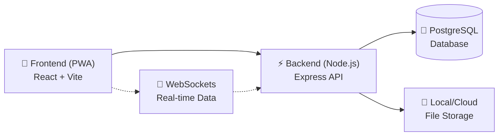

# Protección Civil — Project Structure

> This file provides a high-level overview of the production codebase structure for technical reviewers. The source code is proprietary and not included in this showcase repository.

```
ProteccionCivil/
├── pwa/                              # Frontend Web Client (React 19 + Vite)
│   ├── public/
│   ├── src/
│   │   ├── assets/                   # Static images, icons, and svgs
│   │   ├── components/               # UI Components by Feature Module
│   │   │   ├── AlertModal/
│   │   │   ├── Alerts/               # General Alarms & Convocations
│   │   │   ├── AutoLock/             # Inactivity PIN AutoLock
│   │   │   ├── Comms/                # WebRTC/WebSocket Communications
│   │   │   ├── ConfirmModal/
│   │   │   ├── Dashboard/            # Main KPI & SOS Dashboard
│   │   │   ├── Directory/            # Emergency Contacts Directory
│   │   │   ├── ErrorBoundary/        # Global Error Capture
│   │   │   ├── Fleet/                # Vehicle Management (ITV, Insurance)
│   │   │   ├── Guides/               # Operational Guides
│   │   │   ├── Inventory/            # Equipment & Material Checkouts (QR)
│   │   │   ├── Layout/               # App Shell, Responsive Sidebar
│   │   │   ├── Login/                # JWT Authentication
│   │   │   ├── Map/                  # Real-Time GPS Tracking (Leaflet)
│   │   │   ├── NewReport/            # Incident Reporting
│   │   │   ├── Notifications/        # In-App & Web Push Notification Hub
│   │   │   ├── Profile/              # Volunteer Profile
│   │   │   ├── Roster/               # Shift Roster & Guards
│   │   │   ├── Services/             # Interventions Lifecycle Management
│   │   │   ├── Settings/
│   │   │   ├── Stats/                # Analytics (Recharts)
│   │   │   ├── Training/             # Courses and Attendance
│   │   │   └── Treasury/             # Expenses & Receipts Ledger
│   │   │
│   │   ├── context/                  # React Context Providers
│   │   │   ├── AuthContext.jsx       # Auth State & Token Refresh
│   │   │   ├── LocationContext.jsx   # Background GPS Tracker
│   │   │   └── ToastContext.jsx      # Global Toast Notifications
│   │   │
│   │   ├── utils/                    # Shared Utilities
│   │   │   ├── appSettings.js        # Global App Configuration
│   │   │   ├── geo.js                # Geolocation Helpers
│   │   │   ├── pin.js                # AutoLock PIN Crypto
│   │   │   ├── push.js               # Web Push API (VAPID) Management
│   │   │   ├── roles.js              # RBAC Permission Guards
│   │   │   ├── sound.js              # SOS/Alert Audio Players
│   │   │   └── validators.js         # Form Validation Logic
│   │   │
│   │   ├── App.jsx                   # Main Router & Guard Integration
│   │   ├── main.jsx                  # React DOM Entry
│   │   └── index.css                 # Global CSS Variables & Theme
│   │
│   ├── package.json
│   └── vite.config.js                # Vite Builder Config
│
├── server/                           # Backend API Server (Node.js/Express)
│   ├── src/
│   │   ├── index.js                  # Express App, WS Server, Routers
│   │   ├── db.js                     # PostgreSQL Connection Pool (pg)
│   │   ├── fileMiddleware.js         # Multer Uploads & MIME Sanitization
│   │   ├── logger.js                 # Structured Application Logging
│   │   ├── protocols.js              # Protocol PDF Service
│   │   └── scheduler.js              # Cron Jobs (e.g., Auto-checkout)
│   │
│   ├── scripts/                      # Database Migration Scripts
│   │   ├── init_db.js
│   │   ├── reset_db.js
│   │   ├── migrate_base64_to_files.js
│   │   └── add_mock.js
│   │
│   ├── Dockerfile                    # Container Deployment
│   ├── .env.example                  # Environment Template
│   └── package.json
│
└── README.md                         # Main Documentation
```

## Architectural Separation



## Key Technology Decisions

- **Fullstack JavaScript:** Utilizing JS on both frontend and backend enables shared validation logic and rapid context switching during development.
- **Vite & React 19:** Chosen for ultra-fast HMR and optimized production bundles for mobile devices (PWA).
- **Native WebSockets:** Pure `ws` implementation without Socket.io overhead for high-frequency GPS coordinate broadcasts.
- **Role-Based Routing:** Component-level access restrictions handled in React context based on JWT payload claims.
