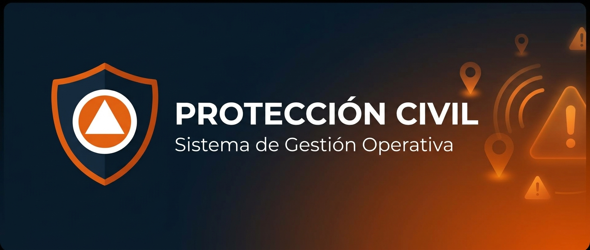
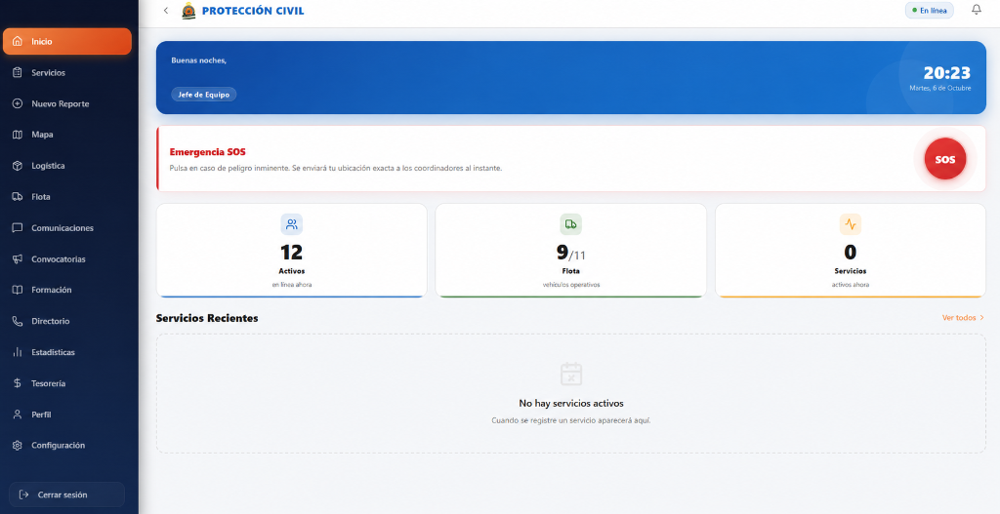
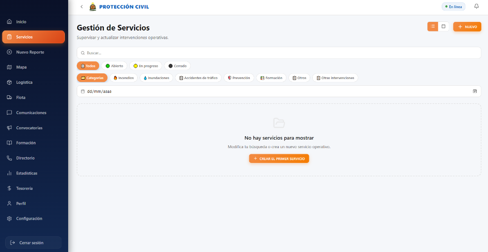
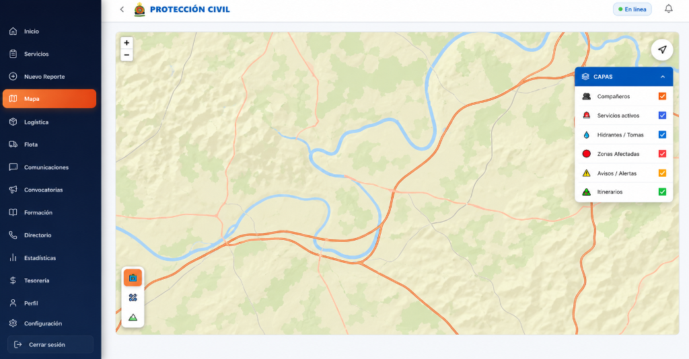
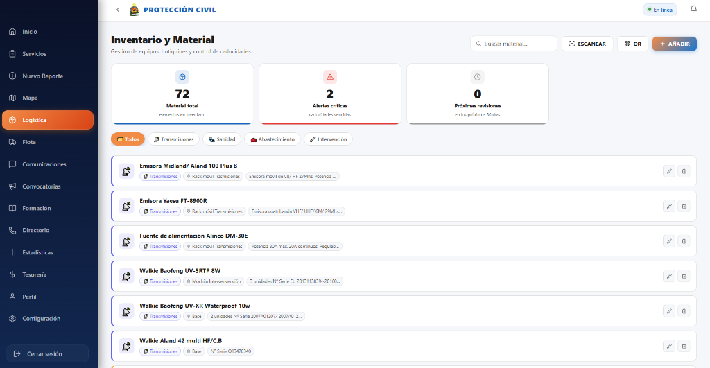
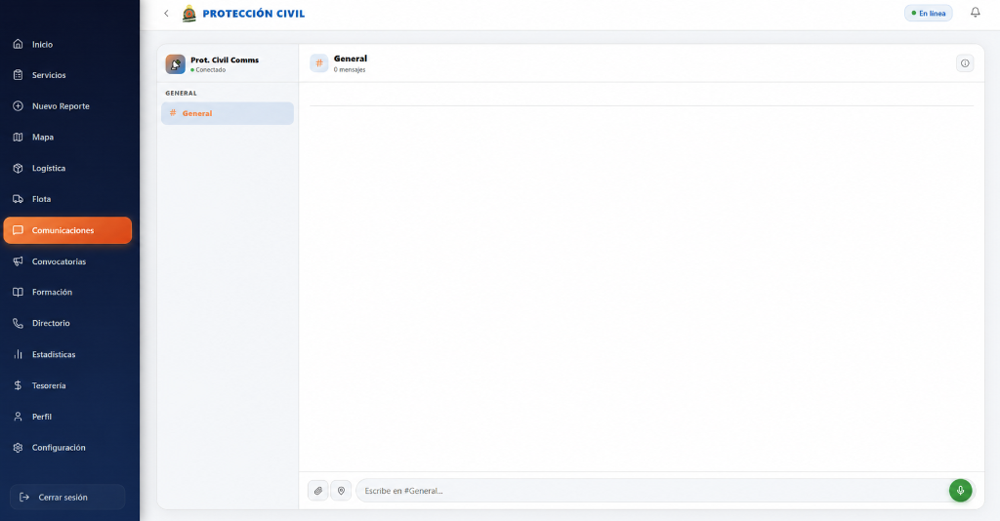
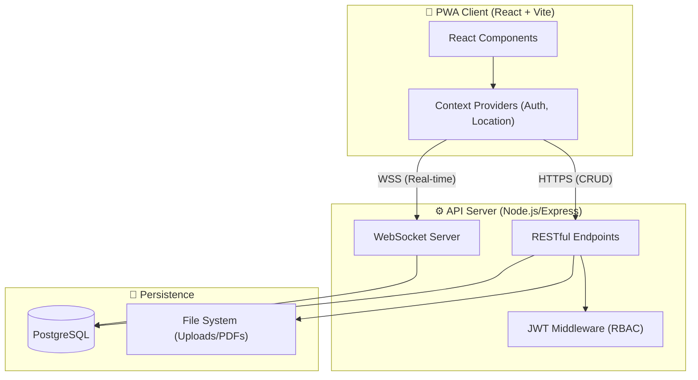
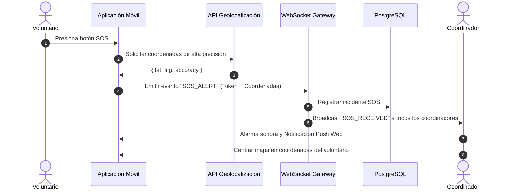

# 🛡️ Protección Civil — Sistema Integral de Gestión Operativa



[](https://react.dev/)
[](https://nodejs.org/)
[](https://www.postgresql.org/)
[](https://developer.mozilla.org/en-US/docs/Web/API/WebSocket)
[]()

**Protección Civil** es una plataforma operativa privada integral, diseñada específicamente para Agrupaciones de Voluntarios de Protección Civil. Su objetivo es centralizar la gestión de emergencias, comunicaciones en tiempo real, logística, y recursos humanos en un único entorno securizado.

Desarrollada como una **Progressive Web App (PWA)**, ofrece la fiabilidad de una aplicación nativa en dispositivos móviles durante intervenciones de campo, garantizando conectividad en tiempo real (vía WebSockets) y telemetría de activos (GPS).

---

## 📋 Índice

- [🌟 Características Principales](#-características-principales)
- [📸 Capturas de Pantalla](#-capturas-de-pantalla)
- [🏗️ Arquitectura de Software](#️-arquitectura-de-software)
- [🛠️ Stack Tecnológico](#️-stack-tecnológico)
- [🔒 Seguridad & Control de Acceso](#-seguridad--control-de-acceso)
- [💻 Extractos de Código Destacados](#-extractos-de-código-destacados)
- [👤 Autor & Contacto](#-autor--contacto)

---

## 🌟 Características Principales

El sistema está compuesto por más de 20 módulos interconectados para cubrir todo el ciclo de vida operativo:

| Módulo Operativo | Descripción Funcional |
| :--- | :--- |
| 🚨 **Dashboard & SOS** | Panel principal con KPIs, personal activo, y botón de pánico SOS que alerta instantáneamente a todos los coordinadores con geolocalización. |
| 🗺️ **Mapa Interactivo (Leaflet)** | Tracking GPS en tiempo real de vehículos y voluntarios, con agrupación de marcadores (clustering) y capas de incidentes. |
| 🚒 **Gestión de Servicios** | Control de intervenciones (incendios, prevención, etc.) con *timeline* de eventos, estados, y asignación de patrullas. |
| 📦 **Logística e Inventario** | Control de stock de almacén con escaneo de códigos QR para *check-in* y *check-out* rápido de material. |
| 🚐 **Gestión de Flota** | Mantenimiento de vehículos de emergencia, control de kilometraje, ITV, y seguros. |
| 💬 **Comunicaciones PTT** | Canales de chat seguros en tiempo real con soporte para envío de mensajes de audio instantáneos. |
| 📅 **Convocatorias & Roster** | Alertas masivas para movilización de personal con respuestas ("Voy" / "No puedo") y gestión de cuadrantes de turnos. |
| 📊 **Analítica & Estadísticas** | Gráficas dinámicas (Recharts) sobre tiempos de respuesta, horas de voluntariado y tipología de incidentes. |
| 🔐 **Seguridad Avanzada** | Auto-bloqueo por inactividad (`AutoLock`) con PIN, autenticación JWT, y RBAC (Control de Acceso Basado en Roles). |

---

## 📸 Capturas de Pantalla

<div align="center">
  
  
</div>

<div align="center">
  
  
  
</div>

---

## 🏗️ Arquitectura de Software

### Diagrama de Capas



### Diagrama de Secuencia: Flujo de Emergencia SOS



---

## 🛠️ Stack Tecnológico

| Entorno | Tecnologías Utilizadas |
| :--- | :--- |
| **Frontend** | React 19, Vite, React Router, Leaflet (Mapas), Recharts (Gráficos) |
| **Backend** | Node.js 22, Express 5, WebSocket (`ws`), Multer, Helmet, bcrypt |
| **Base de Datos** | PostgreSQL (driver `pg`), migraciones manuales (SQL) |
| **Autenticación** | JSON Web Tokens (JWT), VAPID (Web Push API) |

---

## 🔒 Seguridad & Control de Acceso

La plataforma maneja información sensible operativa, por lo que integra múltiples capas de defensa:

- **Autenticación JWT:** Tokens firmados criptográficamente para validación *stateless*.
- **Jerarquía RBAC:** 4 niveles de permisos (Voluntario, Jefe de Equipo, Coordinador, Administrador) que alteran dinámicamente la UI y protegen las rutas API.
- **AutoLock:** Los terminales se bloquean automáticamente tras minutos de inactividad, exigiendo un PIN numérico rápido para reanudar operaciones.
- **Hardening (Helmet & CORS):** Cabeceras de seguridad estrictas que evitan Clickjacking, XSS, e inyecciones; limitando el tráfico solo a orígenes permitidos.

---

## 💻 Extractos de Código Destacados

### 1. Auto-Bloqueo de Sesión por Inactividad (Frontend)

Mecanismo para garantizar que un dispositivo abandonado en una emergencia no exponga datos confidenciales.

```jsx
// src/components/AutoLock/AutoLock.jsx
useEffect(() => {
  let timeoutId;
  const resetTimer = () => {
    clearTimeout(timeoutId);
    // Si no está bloqueado, reiniciar temporizador
    if (!isLocked) {
      timeoutId = setTimeout(() => {
        setIsLocked(true);
      }, appSettings.INACTIVITY_TIMEOUT_MS); 
    }
  };

  const activityEvents = ['mousedown', 'mousemove', 'keypress', 'scroll', 'touchstart'];
  activityEvents.forEach(e => document.addEventListener(e, resetTimer));

  resetTimer();
  return () => {
    clearTimeout(timeoutId);
    activityEvents.forEach(e => document.removeEventListener(e, resetTimer));
  };
}, [isLocked]);
```

### 2. Broadcast WebSocket para Tracking GPS (Backend)

Emisión eficiente de coordenadas para el panel de mando.

```javascript
// server/index.js
ws.on('message', async (message) => {
  try {
    const data = JSON.parse(message);
    
    // Verificación de token antes de procesar
    const user = verifyToken(data.token);
    if (!user) return;

    if (data.type === 'LOCATION_UPDATE') {
      const { lat, lng } = data.payload;
      
      // Actualizar base de datos
      await db.query('UPDATE active_volunteers SET lat=$1, lng=$2 WHERE id=$3', [lat, lng, user.id]);
      
      // Re-transmitir solo a Coordinadores conectados
      broadcastToRole('Coordinador', {
        type: 'VOLUNTEER_MOVED',
        payload: { userId: user.id, lat, lng }
      });
    }
  } catch (err) {
    logger.error('WS Message Error', err);
  }
});
```

---

## 👤 Autor & Contacto

Desarrollado y diseñado por **Andrea Hidara**.

Este repositorio es una demostración técnica de la arquitectura de la aplicación de Protección Civil. El código fuente original es privado.
